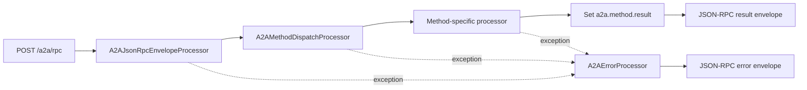
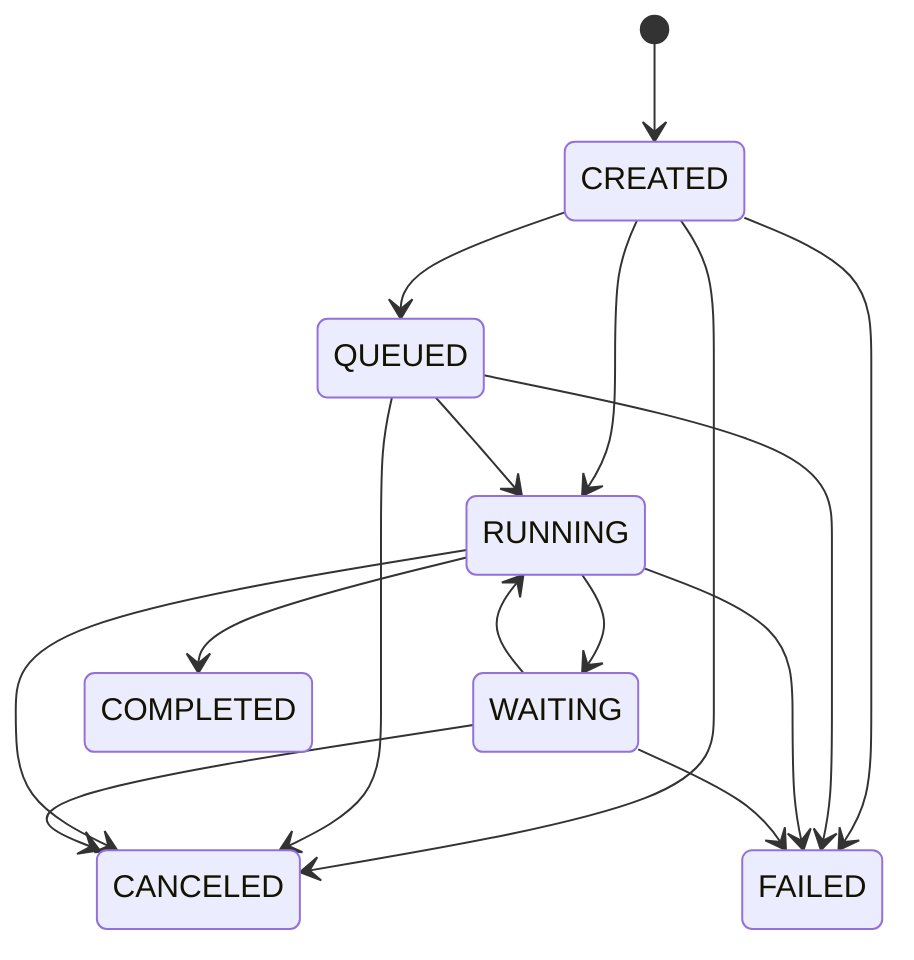

# Detailed Architecture

## 1. System Overview

This repository contains two related, but distinct, runtime concerns:

1. A Camel component (`a2a:` URIs) for embedding A2A-style interactions inside Camel routes.
2. A protocol service runtime (sample application) that exposes A2A-compatible HTTP endpoints over Undertow.

These concerns share the same model, processor, and service layers under `camel-a2a-component`.

## 2. Module Boundaries

- `/Users/roman/Projects/DScope/CamelA2AComponent/camel-a2a-component`
- `/Users/roman/Projects/DScope/CamelA2AComponent/samples/a2a-yaml-service`

Root aggregation and shared versions are defined in `/Users/roman/Projects/DScope/CamelA2AComponent/pom.xml`.

## 3. Core Runtime Composition

`A2AComponentApplicationSupport` is the primary composition root for the protocol service runtime.

It binds:

- Core processors:
  - `A2AJsonRpcEnvelopeProcessor`
  - `A2AMethodDispatchProcessor`
  - `A2AErrorProcessor`
  - `A2ADiagnosticsProcessor`
  - `A2ATaskSseProcessor`
  - `AgentCardDiscoveryProcessor`
- Method processors:
  - `SendMessageProcessor`
  - `SendStreamingMessageProcessor`
  - `GetTaskProcessor`
  - `ListTasksProcessor`
  - `CancelTaskProcessor`
  - `SubscribeToTaskProcessor`
  - `CreatePushNotificationConfigProcessor`
  - `GetPushNotificationConfigProcessor`
  - `ListPushNotificationConfigsProcessor`
  - `DeletePushNotificationConfigProcessor`
  - `GetExtendedAgentCardProcessor`
- Services:
  - `InMemoryA2ATaskService` or `PersistentA2ATaskService`
  - `InMemoryTaskEventService` or `PersistentA2ATaskEventService`
  - `InMemoryPushNotificationConfigService`
- Discovery/catalog:
  - `DefaultAgentCardCatalog`
  - signer/verifier/policy checker implementations

## 4. Request Pipeline (JSON-RPC)

### 4.1 Envelope Validation Responsibilities

`A2AJsonRpcEnvelopeProcessor` enforces:

- Payload must be a JSON object.
- `jsonrpc` must equal `"2.0"`.
- Request envelopes must contain valid string `method`.
- Request envelopes may not include `result`/`error`.
- Response envelopes must contain exactly one of `result` or `error` plus `id`.
- Method whitelist checks against `A2AProtocolMethods.CORE_METHODS`.

It also stores normalized properties in the exchange:

- `a2a.envelope.type`
- `a2a.request.id`
- `a2a.method`
- `a2a.raw.payload`
- `a2a.params.normalized`

### 4.2 Dispatch Responsibilities

`A2AMethodDispatchProcessor`:

- Resolves method -> processor mapping.
- Executes target processor.
- For requests, wraps `a2a.method.result` into JSON-RPC success envelope.
- For notifications, returns empty body.

## 5. Method Surface

Canonical method constants are declared in `A2AProtocolMethods`:

- `SendMessage`
- `SendStreamingMessage`
- `GetTask`
- `ListTasks`
- `CancelTask`
- `SubscribeToTask`
- `CreatePushNotificationConfig`
- `GetPushNotificationConfig`
- `ListPushNotificationConfigs`
- `DeletePushNotificationConfig`
- `GetExtendedAgentCard`
- `intent/execute` (legacy compatibility constant)

## 6. Task Lifecycle Model

Task state enum:

- `CREATED`
- `QUEUED`
- `RUNNING`
- `WAITING`
- `COMPLETED`
- `FAILED`
- `CANCELED`

Transition rules are enforced in `InMemoryA2ATaskService`.

Additional task lifecycle characteristics:

- Idempotency dedupes by `idempotencyKey` or `message.messageId`.
- History is retained per task in memory.
- Every transition emits a task event.

## 7. Event and Streaming Model

`InMemoryTaskEventService` provides:

- Per-task sequence counters.
- In-memory event buffers.
- Subscription creation and acknowledgement.
- Terminal subscription cleanup.

`A2ATaskSseProcessor` renders events as SSE payload with:

- `id: <sequence>`
- `event: task.status`
- `data: <TaskEvent JSON>`

For terminal tasks, it emits:

- `event: close`
- terminal metadata payload

## 8. Push Notification Subsystem

`InMemoryPushNotificationConfigService` responsibilities:

- Validate and store push configs.
- Filter applicable configs per task event.
- Attempt delivery through `PushNotificationNotifier`.
- Retry with bounded backoff.
- Emit observer callbacks for attempt/success/failure.
- Maintain aggregate delivery stats (`attempts`, `successes`, `failures`).

These metrics are included in `/diagnostics` output.

## 9. Agent Card Subsystem

- `DefaultAgentCardCatalog` materializes card payloads.
- `AgentCardDiscoveryProcessor` serves discovery endpoint.
- `GetExtendedAgentCardProcessor` returns protocol method result.
- Signing and verification are currently permissive/no-op defaults in sample wiring.

## 10. Sample HTTP Route Topology

Both basic and standalone route files expose:

- `GET /health`
- `GET /diagnostics`
- `POST /a2a/rpc`
- `GET /a2a/sse/{taskId}`
- `GET /.well-known/agent-card.json`

Routes use `doTry`/`doCatch` patterns and delegate errors to `a2aErrorProcessor`.

## 11. Camel Component Layer (`a2a:`)

The endpoint stack includes:

- `A2AComponent`
- `A2AEndpoint`
- `A2AProducer`
- `A2AConsumer`
- `A2AConsumerRouteService`

This path is oriented around endpoint URIs (`remoteUrl`, `serverUrl`) and route registration for consumer-side processing.

## 12. Backward Compatibility

Compatibility shims are present in `io.dscope.camel.a2a` for classes that moved into subpackages (for example configuration and codec aliases). This helps older imports continue compiling while internal structure evolves.

## 13. Architectural Constraints

Current implementation constraints:

- Push configuration storage remains in-memory.
- No persistence/recovery across process restarts.
- No distributed coordination.
- No built-in authentication middleware on sample endpoints.

These constraints are acceptable for local development and protocol hardening but should be replaced for production deployment.

When `camel.persistence.enabled=true`, task and task-event state can be backed by `camel-persistence` `FlowStateStore` backends (for example Redis/JDBC), enabling dehydration/rehydration across process restarts.

## 14. Extension Points

Primary extension points:

- Replace in-memory services with persistent/service-backed implementations.
- Add authentication/authorization processors before dispatch.
- Add custom `PushNotificationNotifier` implementations.
- Add additional method processors and include them in dispatch map.
- Override bean wiring through `A2AComponentApplicationSupport.createMain(..., customizer)`.
